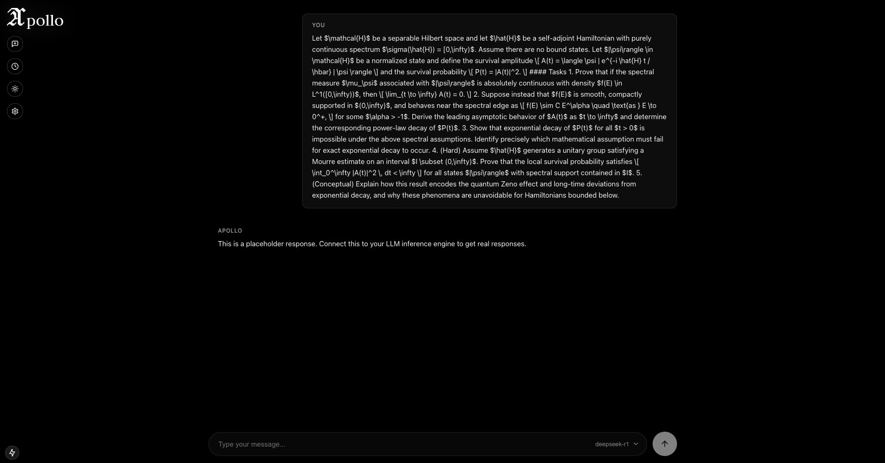
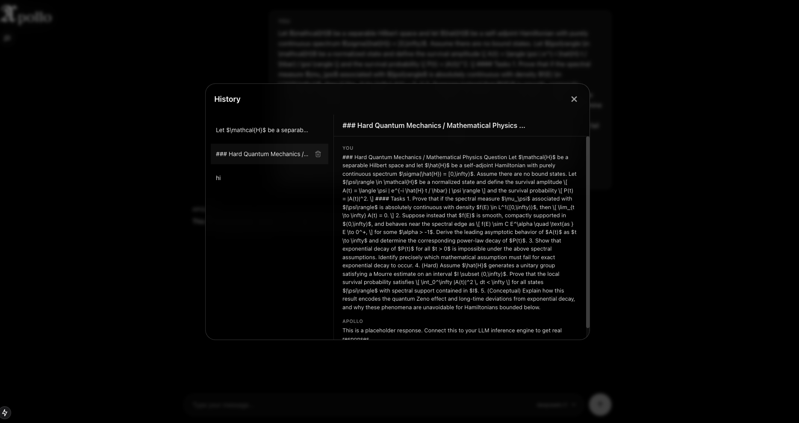

# apollo

llm inference engine + chat

<table style="border-collapse: collapse; border: none;">
  <tr>
    <td style="border: none; padding: 5px;"></td>
    <td style="border: none; padding: 5px;"></td>
    <td style="border: none; padding: 5px;"></td>
  </tr>
</table>
